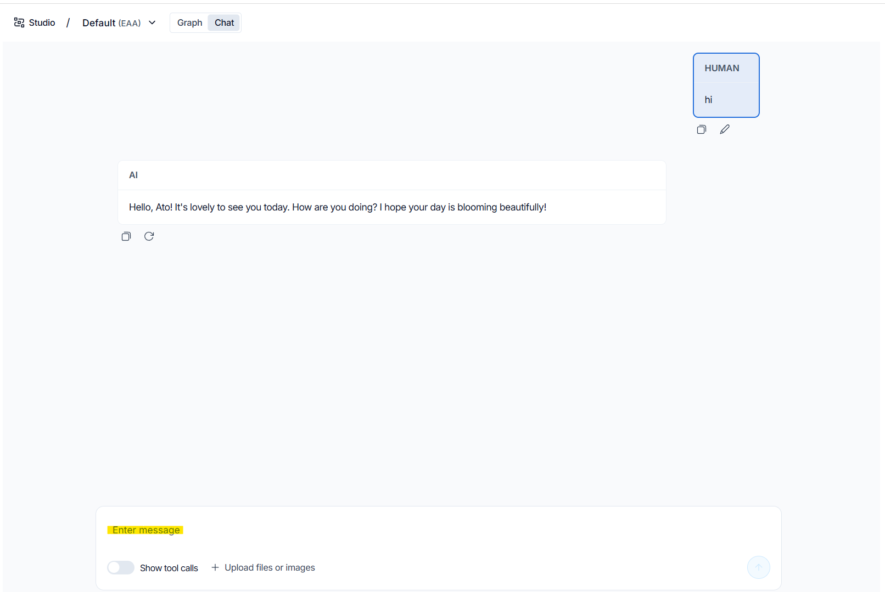

# RoomLogic

An intelligent agent powered by LangGraph for interactive conversations and decision-making.

## Quick Start

### 1. Install Docker

Download and install Docker from [docker.com](https://www.docker.com/products/docker-desktop).

### 2. Run the Application

From the project directory, run:

```bash
langgraph up -d .\docker-compose.debug.yml
```

This starts the LangGraph server and required services in the background.

### 3. Go to Chat

Open your browser and navigate to:

```
https://smith.langchain.com/studio/?baseUrl=http://127.0.0.1:8123
```

The chat interface will be available for you to interact with.

### 4. Start Chatting

Simply type your messages in the chat box and press Enter. The agent will respond with intelligent replies based on the configured logic and tools.

<div align="center">
  
</div>

